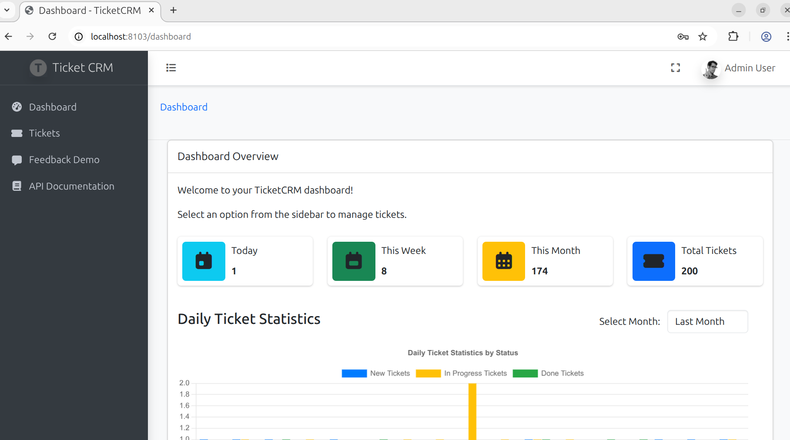
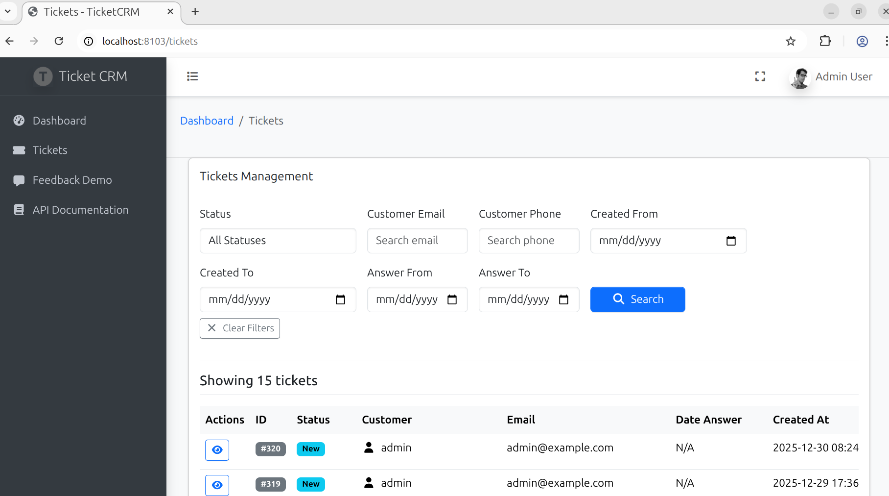
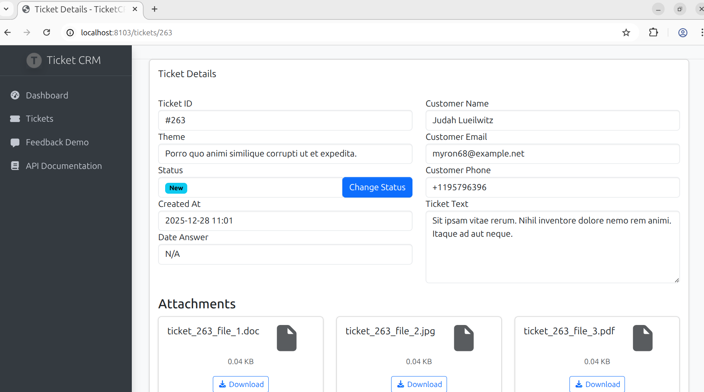
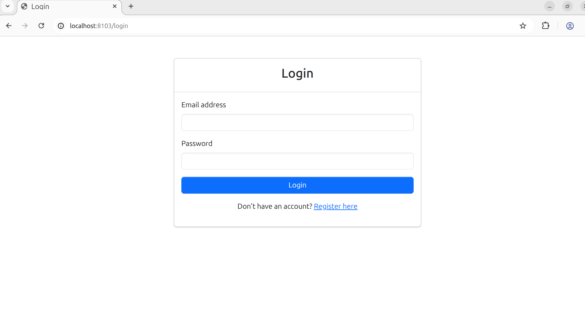
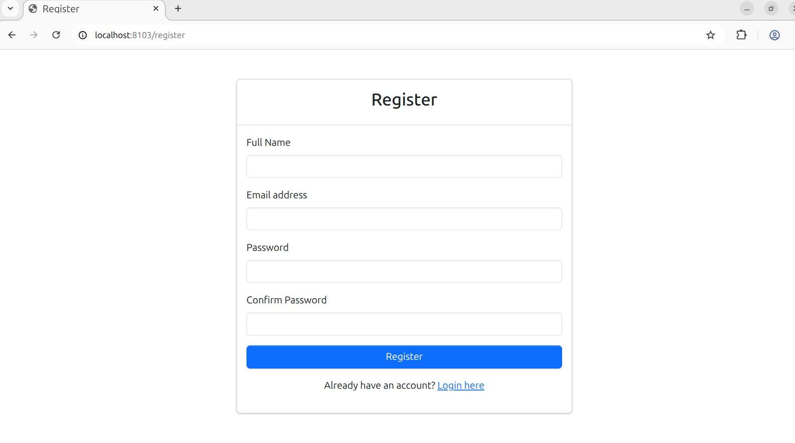
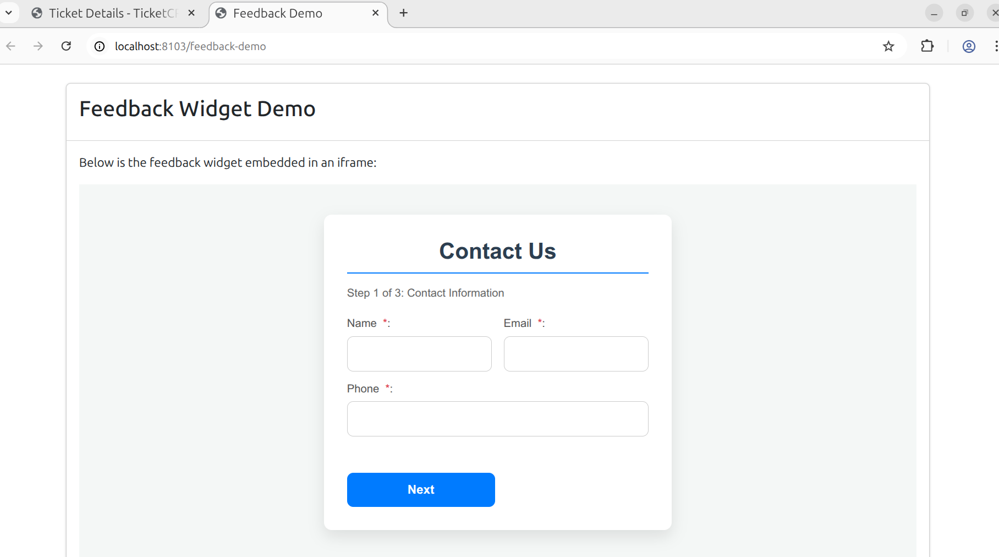
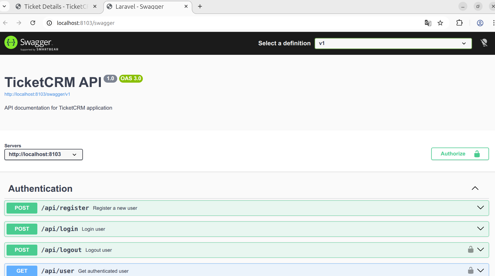

# TicketCRM

A comprehensive ticket management system built with Laravel, designed to help businesses manage customer support tickets efficiently.

## Project Overview

TicketCRM is a web application that provides a complete solution for tracking, managing, and resolving customer support tickets. The system includes user authentication, role-based access control, file attachments, and comprehensive dashboard analytics.

## Screenshots


*Dashboard view showing ticket statistics and analytics*


*Tickets list view with filtering and search capabilities*


*Detailed view of a specific ticket with attachments*


*Login page for user authentication*


*Registration page for new user signup*


*Feedback widget demo page with embed instructions*


*Swagger UI for API documentation and testing*

## Features

- User authentication and authorization
- Role-based access control (RBAC)
- Ticket creation, management, and resolution
- File attachment support for tickets
- Dashboard with statistics and analytics
- API endpoints for integration
- Responsive design for mobile and desktop
- Comprehensive testing suite
- Feedback widget for customer communication
- Embeddable feedback form via iframe

## Architecture

TicketCRM follows the Model-View-Controller (MVC) architectural pattern with Laravel, providing a clean separation of concerns:

- **Models**: Represent the data layer with Eloquent ORM (Customer, Ticket, User models)
- **Views**: Blade templates for the presentation layer
- **Controllers**: Handle HTTP requests and application logic
- **Services**: Business logic encapsulation in dedicated service classes
- **Repositories**: Data access layer abstraction
- **Observers**: Automatic model event handling
- **Strategies**: Implementation of strategy pattern for date range calculations

## Technical Details

### Core Components

- **Framework**: Laravel 12.x with PHP 8.4
- **Database**: MySQL 8.0 with Eloquent ORM
- **Authentication**: Laravel Sanctum for API authentication
- **Authorization**: Spatie Laravel Permission package for role-based access control
- **File Management**: Spatie Laravel Media Library for file attachments
- **API Documentation**: Swagger UI integration
- **Caching**: Redis for caching and session storage
- **Queue Management**: Database queue system for background jobs
- **Testing**: PHPUnit with both feature and unit tests

### Key Services

- **TicketService**: Handles business logic for ticket operations
- **FileService**: Manages file uploads and storage
- **RateLimitService**: Implements rate limiting for API endpoints
- **TicketManager**: Orchestrates complex ticket operations

### Security Features

- CSRF protection
- SQL injection prevention through Eloquent ORM
- XSS protection through Blade templating
- Rate limiting for API endpoints
- Role-based access control
- File upload validation and sanitization

### API Endpoints

The application provides RESTful API endpoints for:
- Authentication (login, register, logout)
- Ticket management (create, read, update, delete)
- User management
- File uploads for tickets

### Additional Features

- **Feedback Widget**: A multi-step form for collecting customer feedback
- **Embeddable Demo**: The feedback widget can be embedded in external sites via iframe

## Technology Stack

- **Backend**: Laravel 12.x
- **Frontend**: Blade templates, JavaScript, CSS
- **Database**: MySQL 8.0
- **Cache**: Redis
- **Queue**: Database queue system
- **Containerization**: Docker, Docker Compose
- **Web Server**: Nginx

## Development Environment Setup

### Prerequisites

- Docker and Docker Compose
- Git

### Installation Steps

1. Clone the repository:
   ```bash
   git clone <repository-url>
   cd TicketCRM
   ```

2. Start the Docker containers:
   ```bash
   docker-compose up -d
   ```

3. Install PHP dependencies inside the container:
   ```bash
   docker exec -it laravel-app composer install
   ```

4. Install Node.js dependencies and build assets inside the container:
   ```bash
   docker exec -it laravel-app npm install
   docker exec -it laravel-app npm run build
   ```

5. Run database migrations and seeders:
   ```bash
   docker exec -it laravel-app php artisan migrate --force
   docker exec -it laravel-app php artisan db:seed
   ```

6. Generate application key:
   ```bash
   docker exec -it laravel-app php artisan key:generate
   ```

7. The application will be accessible at `http://localhost:8103`

## Production Deployment

### Environment Configuration

Before deploying to production, ensure the following environment variables are properly configured in the `.env` file:

```
APP_ENV=production
APP_DEBUG=false
APP_URL=https://your-domain.com
APP_KEY=your-app-key-here
APP_NAME="TicketCRM"

DB_CONNECTION=mysql
DB_HOST=your-database-host
DB_PORT=306
DB_DATABASE=your-database-name
DB_USERNAME=your-database-username
DB_PASSWORD=your-database-password

CACHE_STORE=redis
QUEUE_CONNECTION=redis
SESSION_DRIVER=redis

REDIS_HOST=your-redis-host
REDIS_PASSWORD=your-redis-password
REDIS_PORT=6379
```

### Production Deployment Steps

1. Clone the repository to your production server:
   ```bash
   git clone <repository-url>
   cd TicketCRM
   ```

2. Update the `docker-compose.yml` file with production-specific configurations:
   - Change `APP_ENV` to `production`
   - Set `APP_DEBUG` to `false`
   - Update database credentials
   - Configure SSL certificates for Nginx if needed

3. Build and start the production containers:
   ```bash
   docker-compose up -d --build
   ```

4. Run database migrations:
   ```bash
   docker exec -it laravel-app php artisan migrate --force
   ```

5. Seed the database with initial data:
   ```bash
   docker exec -it laravel-app php artisan db:seed
   ```

6. Clear and cache configuration:
   ```bash
   docker exec -it laravel-app php artisan config:cache
   docker exec -it laravel-app php artisan route:cache
   docker exec -it laravel-app php artisan view:cache
   ```

7. Set proper file permissions:
   ```bash
   sudo chown -R www-data:www-data src/storage
   sudo chown -R www-data:www-data src/bootstrap/cache
   ```

### Security Considerations

- Set `APP_DEBUG=false` in production to prevent sensitive information exposure
- Use strong, unique values for `APP_KEY`
- Configure proper SSL certificates for HTTPS
- Set secure session and cookie configurations
- Regularly update dependencies and security patches
- Implement proper backup strategies for database and files

### Performance Optimization

- Enable OPcache in PHP configuration
- Use Redis for caching, sessions, and queues
- Optimize database queries and use indexing
- Implement CDN for static assets
- Configure proper Nginx caching headers
- Use Laravel's built-in optimization commands

## API Documentation

The application provides a comprehensive API for integration with other systems. API documentation is available at `/api/documentation` endpoint when the application is running.

## Default Login Credentials

After running the database seeders, the following default accounts will be available:

### Admin Account
- **Email**: `admin@example.com`
- **Password**: `password123`
- **Role**: Administrator (full access)

### Manager Accounts
- **Emails**: `manager1@example.com` through `manager5@example.com`
- **Password**: `password123`
- **Role**: Manager (limited access - dashboard, content management)

## Feedback Widget and Demo

The application includes an embeddable feedback widget that allows customers to submit feedback without logging in. This feature is particularly useful for gathering customer input without requiring account creation.

### Feedback Widget Features

- Multi-step form with contact information, details, and file attachments
- Contact information step (name, email, phone)
- Feedback details step (theme, text)
- File attachment step (optional file uploads)
- Responsive design that works on mobile and desktop

### Feedback Demo Page

The demo page is available at `/feedback-demo` and shows how to embed the feedback widget using an iframe. The demo page includes:

- An iframe containing the feedback widget
- Sample embed code that can be used on external websites
- Proper sandbox attributes for security when embedding

### Embedding the Widget

To embed the feedback widget on your own site, use the following iframe code:

```html
<iframe
    src="http://localhost:8103/feedback-widget"
    width="100%"
    height="550px"
    frameborder="0"
    title="Feedback"
    sandbox="allow-scripts allow-forms"
    loading="lazy">
</iframe>
```

The widget is fully self-contained and allows visitors to submit feedback that will be processed by the TicketCRM application.

## Testing

To run the test suite:

```bash
# Run all tests
docker exec -it laravel-app php artisan test

# Run feature tests
docker exec -it laravel-app php artisan test --testsuite=Feature

# Run unit tests
docker exec -it laravel-app php artisan test --testsuite=Unit
```

## Maintenance

### Regular Maintenance Tasks

- Database backups
- Log rotation
- Security updates
- Performance monitoring
- Cache clearing (when needed)

### Backup and Recovery

1. Database backup:
   ```bash
   docker exec laravel-mysql mysqldump -u laravel_user -p laravel_db > backup.sql
   ```

2. Restore database:
   ```bash
   docker exec -i laravel-mysql mysql -u laravel_user -p laravel_db < backup.sql
   ```

## Troubleshooting

### Common Issues

1. **Application not loading**: Check if all Docker containers are running:
   ```bash
   docker-compose ps
   ```

2. **Database connection errors**: Verify database credentials in `.env` and ensure the database container is running.

3. **Permission errors**: Ensure proper file permissions for storage and cache directories.

4. **Cache issues**: Clear application cache:
   ```bash
   docker exec -it laravel-app php artisan cache:clear
   ```

## Support

For support and questions, please contact the development team or submit an issue through the repository's issue tracker.